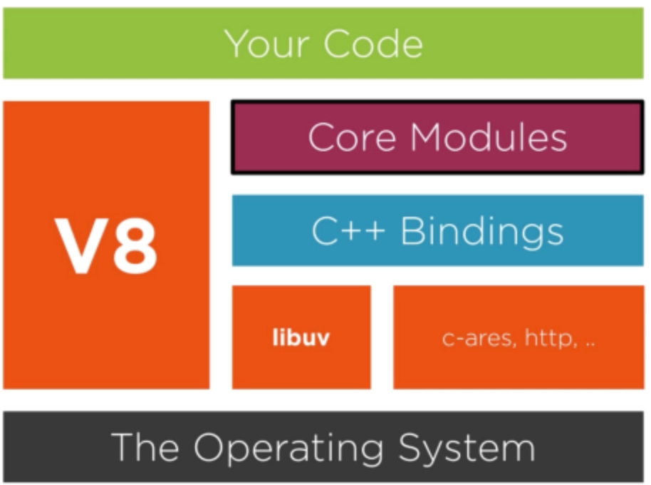

# Event loop

Takes care of asynchronous code execution for JS engines (or events), scheduling code to be executed and enqueuing response callbacks allowing Node.js to perform non-blocking I/O operations despite the fact that JS is single-threaded. In practice this is done by monitoring the call stack and the callback queue (macrotask queue). Every time the call stack is empty, the event loop takes a callback from the callback queue and execute this into the call stack. Each time this occurs we call a tick. Some actions don't add a callback into the macrotask queue, but actually will enqueue an item into the Microtask queue. In general, only one macrotask is processed in one tick of event loop. After that, all the jobs/microtask in the Microtask queue should all be run one by one at the end of the same tick. 

Node.js and its dependencies:

where the main dependencies are

## [libuv](https://vimeo.com/24713213)

Abstracts libev (event package), but also deals with thread-pool, signalling, inter-process communication as well as dns resolution, file system operations, etc. Event loop is implemented by libuv.

## V8
