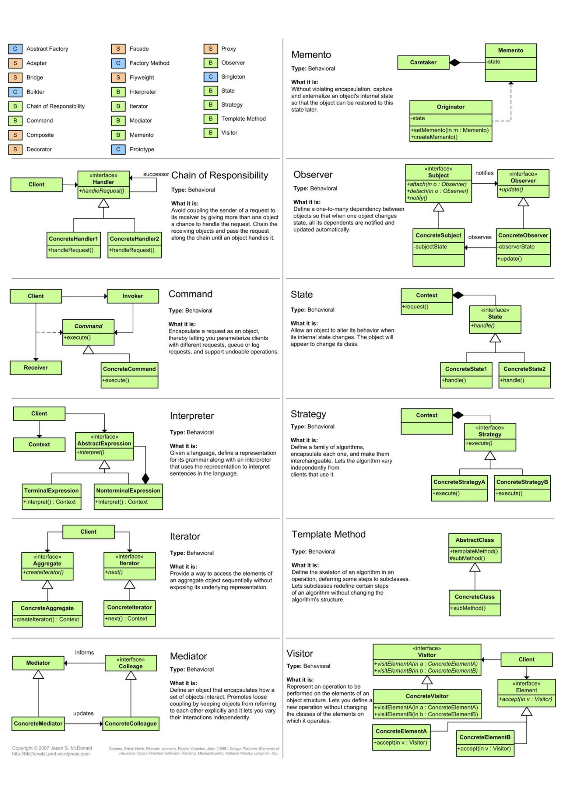
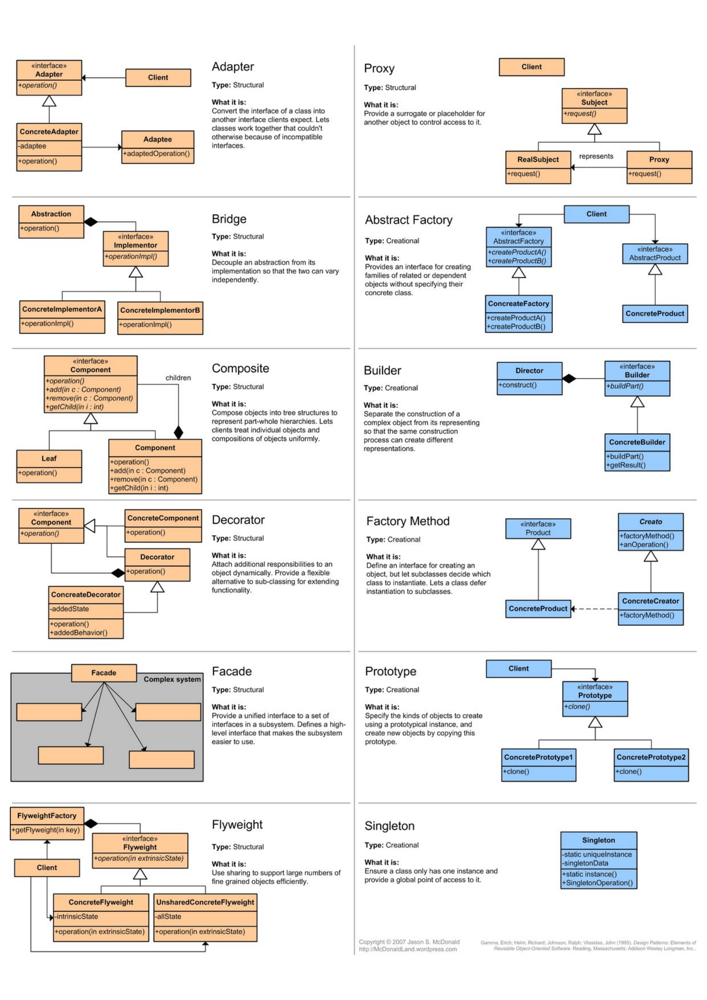

# Design Patterns

Design patterns are reusable solutions to common problems in software design. They provide templates for writing maintainable, scalable code.

**Key References:**

- [Association vs Aggregation vs Composition](https://stackoverflow.com/questions/885937/what-is-the-difference-between-association-aggregation-and-composition/34069760#34069760)
- [Design Patterns Overview](https://medium.com/xp-inc/design-patterns-727494af001d)

> ⚠️ **Remember**: Always be alert and beware of over-application. Not every problem needs a design pattern.

---

# Structural Patterns Comparison

Used for organizing relationships between entities (objects, classes).

| **Pattern**   | **Intent**                                 | **Key Benefit**                                             | **When to Use**                              | **Complexity** | **Common Pitfall**                         |
| ------------- | ------------------------------------------ | ----------------------------------------------------------- | -------------------------------------------- | -------------- | ------------------------------------------ |
| **Adapter**   | Make incompatible interfaces work together | Integrate legacy code with new systems                      | Existing app + incompatible classes          | Low            | Over-engineering simple conversions        |
| **Bridge**    | Decouple abstraction from implementation   | Allow independent evolution of both                         | Multiple implementations of same interface   | Medium         | Overcomplicating when inheritance suffices |
| **Proxy**     | Control access to another object           | Add behavior without modifying subject                      | Lazy loading, access control, logging        | Low            | Hiding real complexity behind proxy        |
| **Decorator** | Add behavior to objects dynamically        | Enables recursive composition & alternatives to subclassing | Need flexible feature stacking               | Medium         | Creating too many decorator layers         |
| **Facade**    | Provide simplified interface to subsystem  | Hide complexity, reduce client coupling                     | Complex subsystems with many classes         | Low            | Facade becomes too god-like                |
| **Composite** | Compose objects into tree hierarchies      | Treat individual objects and compositions uniformly         | File systems, UI trees, org hierarchies      | Medium         | Forcing everything into tree structure     |
| **Flyweight** | Share common state across many objects     | Reduce memory for large object counts                       | Many similar objects (particles, characters) | High           | Complexity not worth it for few objects    |

---

# Behavioral Patterns Comparison

Used for communication between entities and responsibility distribution.

| **Pattern**                 | **Intent**                                              | **Key Benefit**                           | **When to Use**                                | **Complexity** | **Common Pitfall**                            |
| --------------------------- | ------------------------------------------------------- | ----------------------------------------- | ---------------------------------------------- | -------------- | --------------------------------------------- |
| **Command**                 | Encapsulate requests as objects                         | Enable undo/redo, queuing, logging        | Action history, task scheduling, macros        | Low            | Over-complicating simple function calls       |
| **Observer**                | Define one-to-many dependencies                         | Loose coupling, reactive updates          | Event systems, MVC, real-time updates          | Low            | Observer explosion, debugging cascade updates |
| **State**                   | Alter behavior based on internal state                  | Eliminates large conditionals             | Finite state machines, workflow engines        | Medium         | Complex state graphs become hard to follow    |
| **Strategy**                | Define family of algorithms                             | Runtime algorithm selection               | Sorting algorithms, pricing rules, compression | Low            | Choosing between strategy and simple if/else  |
| **Template Method**         | Define algorithm skeleton in base class                 | Code reuse via inheritance                | Similar algorithms with varying steps          | Low            | Violating Liskov Substitution Principle       |
| **Chain of Responsibility** | Pass request along chain of handlers                    | Flexible handler assignment               | Logging, event handling, approval workflows    | Medium         | Long chains become hard to debug              |
| **Iterator**                | Access elements sequentially without exposing structure | Abstraction over collection internals     | Traversing custom data structures              | Low            | Over-generalizing simple loops                |
| **Mediator**                | Centralize complex communications                       | Reduces object interdependencies          | UI components, MVC, complex workflows          | Medium         | Mediator becomes communication bottleneck     |
| **Memento**                 | Capture/restore object state                            | Undo/redo without violating encapsulation | History features, snapshots, checkpoints       | Medium         | Memory overhead for state snapshots           |
| **Visitor**                 | Add operations to objects without modifying them        | Adding behavior to complex hierarchies    | AST traversal, compilers, report generation    | High           | Tight coupling when hierarchy changes         |

---

# Creational Patterns Comparison

Used for object creation mechanisms.

| **Pattern**          | **Intent**                                | **Key Benefit**                            | **When to Use**                            | **Complexity** | **Common Pitfall**                          |
| -------------------- | ----------------------------------------- | ------------------------------------------ | ------------------------------------------ | -------------- | ------------------------------------------- |
| **Singleton**        | Ensure single instance                    | Global access point, shared state          | Logging, config, database connections      | Low            | Hidden dependencies, hard to test           |
| **Factory Method**   | Create objects without specifying classes | Flexibility in object creation             | Plugin systems, framework extensibility    | Low            | Over-engineering when `new` suffices        |
| **Abstract Factory** | Create families of related objects        | Consistency across product families        | UI themes, cross-platform GUIs, DB drivers | Medium         | Complexity not justified for small families |
| **Builder**          | Construct complex objects step-by-step    | Readable construction, optional parameters | Complex objects with many options          | Low            | Overkill for simple objects                 |
| **Prototype**        | Create objects by cloning                 | Avoid expensive construction               | Copy-heavy operations, object pools        | Low            | Deep vs shallow copy confusion              |

---

# Quick Decision Table

**Choose based on your problem:**

| **Problem**                          | **Patterns to Consider**   | **Best Fit**                                              |
| ------------------------------------ | -------------------------- | --------------------------------------------------------- |
| Too many incompatible interfaces     | Adapter, Facade, Bridge    | Adapter (quick fix) or Bridge (long-term)                 |
| Add features without modifying class | Decorator, Strategy        | Decorator (stacking) or Strategy (swapping)               |
| Complex state transitions            | State, Strategy            | State (if state matters), Strategy (if algorithm)         |
| Multiple algorithms to switch        | Strategy, Bridge           | Strategy (runtime selection)                              |
| Large object graphs                  | Composite, Iterator        | Composite (hierarchies), Iterator (traversal)             |
| Create objects conditionally         | Factory, Abstract Factory  | Factory Method (single type), Abstract Factory (families) |
| History/undo functionality           | Command, Memento           | Command (action history), Memento (state snapshots)       |
| Many communicating objects           | Observer, Mediator         | Observer (one-way) or Mediator (complex)                  |
| Too many subclasses                  | Strategy, State, Decorator | Depends on problem domain                                 |

---

# Pattern Categories by Frequency

**Most Used (90% of real projects):**

- Strategy, Adapter, Observer, Factory Method, Decorator

**Common (50% of projects):**

- Command, State, Builder, Singleton, Facade

**Occasionally Used (10-20%):**

- Template Method, Chain of Responsibility, Proxy, Composite, Iterator

**Rarely Used (< 5%):**

- Mediator, Memento, Visitor, Flyweight, Abstract Factory

---

## Implementations in this Repository

| Pattern                     | Category   | Source                                                                    | Complexity | Status |
| --------------------------- | ---------- | ------------------------------------------------------------------------- | ---------- | ------ |
| **Adapter**                 | Structural | [patterns/structural/adapter/](../../../patterns/structural/adapter/)     | Low        | ✅     |
| **Bridge**                  | Structural | [patterns/structural/bridge/](../../../patterns/structural/bridge/)       | Medium     | ✅     |
| **Proxy**                   | Structural | [patterns/structural/proxy/](../../../patterns/structural/proxy/)         | Low        | ✅     |
| **Decorator**               | Structural | [patterns/structural/decorator/](../../../patterns/structural/decorator/) | Medium     | ✅     |
| **Facade**                  | Structural | [patterns/structural/facade/](../../../patterns/structural/facade/)       | Low        | ✅     |
| **Composite**               | Structural | patterns/structural/composite/                                            | Medium     | ⏳     |
| **Flyweight**               | Structural | patterns/structural/flyweight/                                            | High       | ⏳     |
| **Command**                 | Behavioral | [patterns/behavioral/command/](../../../patterns/behavioral/command/)     | Low        | ✅     |
| **Observer**                | Behavioral | [patterns/behavioral/observer/](../../../patterns/behavioral/observer/)   | Low        | ✅     |
| **State**                   | Behavioral | [patterns/behavioral/state/](../../../patterns/behavioral/state/)         | Medium     | ✅     |
| **Strategy**                | Behavioral | [patterns/behavioral/strategy/](../../../patterns/behavioral/strategy/)   | Low        | ✅     |
| **Template Method**         | Behavioral | [patterns/behavioral/template/](../../../patterns/behavioral/template/)   | Low        | ✅     |
| **Chain of Responsibility** | Behavioral | patterns/behavioral/chain/                                                | Medium     | ⏳     |
| **Iterator**                | Behavioral | patterns/behavioral/iterator/                                             | Low        | ⏳     |
| **Mediator**                | Behavioral | patterns/behavioral/mediator/                                             | Medium     | ⏳     |
| **Memento**                 | Behavioral | patterns/behavioral/memento/                                              | Medium     | ⏳     |
| **Visitor**                 | Behavioral | patterns/behavioral/visitor/                                              | High       | ⏳     |
| **Singleton**               | Creational | patterns/creational/singleton/                                            | Low        | ⏳     |
| **Factory Method**          | Creational | patterns/creational/factory/                                              | Low        | ⏳     |
| **Abstract Factory**        | Creational | patterns/creational/abstract-factory/                                     | Medium     | ⏳     |
| **Builder**                 | Creational | patterns/creational/builder/                                              | Low        | ⏳     |
| **Prototype**               | Creational | patterns/creational/prototype/                                            | Low        | ⏳     |

---

## Pattern Comparison by Specific Dimensions

### Complexity vs Benefit

```
High Benefit, Low Complexity (USE FIRST):
├─ Observer (loosely coupled event systems)
├─ Strategy (flexible algorithm selection)
├─ Adapter (solve interface mismatch)
├─ Command (action history)
└─ Factory Method (flexible object creation)

Medium Benefit, Medium Complexity (USE WHEN NEEDED):
├─ Bridge (long-term abstraction evolution)
├─ Decorator (flexible feature composition)
├─ State (complex state machines)
├─ Template Method (algorithm structure reuse)
└─ Builder (complex object construction)

High Benefit, High Complexity (USE SPARINGLY):
├─ Visitor (complex AST operations)
├─ Mediator (multi-object communication)
└─ Memento (comprehensive state capture)

Low Benefit, High Complexity (AVOID):
└─ Over-using any pattern
```

### Inheritance vs Composition

| Pattern         | Uses Inheritance | Uses Composition | Best Practice                  |
| --------------- | ---------------- | ---------------- | ------------------------------ |
| Template Method | ✅ Heavy         | ❌ No            | Prefer composition if possible |
| Strategy        | ❌ No            | ✅ Heavy         | Composition approach preferred |
| Decorator       | ❌ No            | ✅ Heavy         | Composition is the point       |
| Bridge          | ✅ Light         | ✅ Heavy         | Both, used together            |
| Adapter         | ❌ No            | ✅ Yes           | Composition in object adapter  |
| Observer        | ❌ No            | ✅ Yes           | Composition pattern            |
| Factory Method  | ✅ Light         | ❌ Minimal       | Inheritance for subclassing    |

### Thread Safety & Concurrency Considerations

| Pattern        | Thread-Safe by Default | Notes                         |
| -------------- | ---------------------- | ----------------------------- |
| Singleton      | ❌ No                  | Must implement proper locking |
| Observer       | ❌ No                  | Update notifications can race |
| Mediator       | ❌ No                  | Complex shared state          |
| State          | ⚠️ Depends             | If state is immutable = safe  |
| Strategy       | ✅ Yes                 | Usually stateless algorithms  |
| Decorator      | ✅ Yes                 | Wrapping is inherently safe   |
| Factory Method | ✅ Yes                 | Object creation is isolated   |

### Testing & Mockability

| Pattern   | Easy to Test | Mockability                      |
| --------- | ------------ | -------------------------------- |
| Strategy  | ✅ Excellent | ✅ Just swap implementation      |
| Observer  | ⚠️ Good      | ⚠️ Need to verify callbacks      |
| Facade    | ✅ Excellent | ✅ Mock the entire facade        |
| Command   | ✅ Excellent | ✅ Test command objects directly |
| Decorator | ✅ Good      | ✅ Wrap with test decorator      |
| State     | ⚠️ Medium    | ⚠️ State transitions complex     |
| Singleton | ❌ Poor      | ❌ Global state hard to mock     |
| Mediator  | ❌ Poor      | ❌ Central dependency hub        |

---

## Decision Flowchart

```
Do you need to change behavior dynamically?
├─ YES: Use Strategy or State
│   ├─ Is it algorithm selection? → Strategy
│   └─ Is it object state? → State
│
└─ NO: Continue...

Do you need to add functionality without modifying class?
├─ YES: Use Decorator or Proxy
│   ├─ Want stacked features? → Decorator
│   └─ Want controlled access? → Proxy
│
└─ NO: Continue...

Do you have incompatible interfaces?
├─ YES: Use Adapter or Facade
│   ├─ One-to-one mapping? → Adapter
│   └─ Simplify complexity? → Facade
│
└─ NO: Continue...

Do you need to manage object creation?
├─ YES: Use Factory or Builder
│   ├─ Simple creation? → Factory Method
│   └─ Complex construction? → Builder
│
└─ NO: Continue...

Do you need event communication?
└─ YES: Use Observer or Mediator
    ├─ One-to-many? → Observer
    └─ Complex interactions? → Mediator
```

---

## Anti-Patterns: What NOT to Do

| Anti-Pattern               | Problem                             | Solution                                 |
| -------------------------- | ----------------------------------- | ---------------------------------------- |
| **God Object**             | Single class does everything        | Use decomposition, apply patterns        |
| **Feature Envy**           | Object uses too much external data  | Move methods closer to data              |
| **Long Parameter Lists**   | Too many constructor/method args    | Use Builder pattern                      |
| **Primitive Obsession**    | Using primitives instead of objects | Create meaningful types                  |
| **Speculative Generality** | Building for imaginary future needs | Keep it simple (YAGNI)                   |
| **Lazy Class**             | Class doesn't add value             | Remove it or merge with others           |
| **Temporary Fields**       | Fields used only sometimes          | Use Strategy or State patterns           |
| **Message Chains**         | a.b().c().d().e()                   | Introduce Facade or intermediate objects |

---

## Visual References




