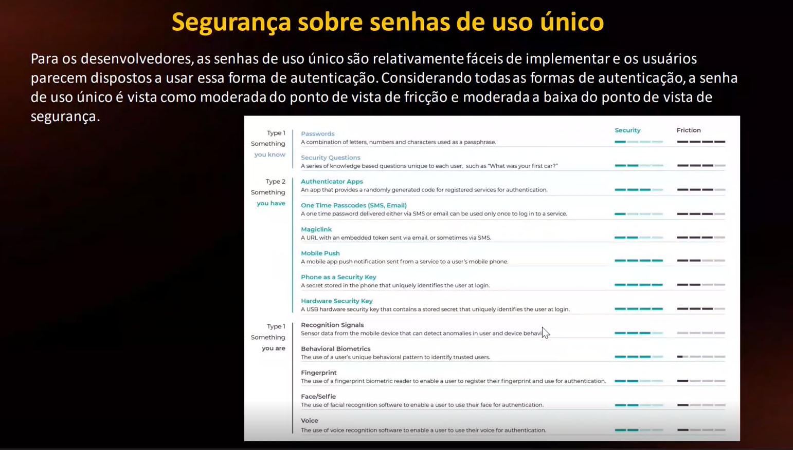
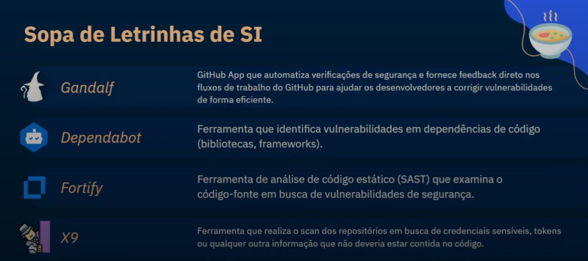

# Security

| Name                                                | Definition                                                              | Example of How It Works                                                                                                                                                       | Fix                                                                                      |
| --------------------------------------------------- | ----------------------------------------------------------------------- | ----------------------------------------------------------------------------------------------------------------------------------------------------------------------------- | ---------------------------------------------------------------------------------------- |
| **A01: Broken Access Control**                      | Users can access data or actions they're not authorized for             | Attacker logs in as a regular user, then modifies a URL like `/user/123/edit` to `/user/124/edit` to access another user’s data                                               | Enforce role-based access control on the backend; deny by default                        |
| **A02: Cryptographic Failures**                     | Sensitive data is exposed due to weak or missing encryption             | Developer stores credit card numbers in plain text; attacker gains DB access and reads the data                                                                               | Use HTTPS, encrypt sensitive data at rest and in transit, avoid outdated algorithms      |
| **A03: Injection**                                  | Attacker sends untrusted input that gets executed as a command or query | Attacker submits `' OR '1'='1` in a login form; server executes `SELECT * FROM users WHERE username = '' OR '1'='1'`                                                          | Use parameterized queries, ORM, input validation                                         |
| **A04: Insecure Design**                            | Security flaws from poor system architecture                            | App has no rate limiting on login; attacker brute-forces passwords until successful                                                                                           | Apply secure design principles, threat modeling, rate limiting, fail-fast mechanisms     |
| **A05: Security Misconfiguration**                  | Default or insecure settings leave the app exposed                      | Admin panel is left exposed at `/admin`; default credentials are still active                                                                                                 | Disable unused features, remove default accounts, automate secure configs                |
| **A06: Vulnerable and Outdated Components**         | Using libraries or tools with known exploits                            | App uses an old version of Log4j; attacker sends a crafted input that triggers remote code execution                                                                          | Use dependency monitoring tools, update dependencies regularly, prefer maintained libs   |
| **A07: Identification and Authentication Failures** | Auth mechanisms are weak or poorly implemented                          | Attacker reuses a stolen session token from a previous login; session isn’t invalidated after logout                                                                          | Implement MFA, invalidate sessions properly, use secure cookies                          |
| **A08: Software and Data Integrity Failures**       | Failing to verify software integrity                                    | App fetches JavaScript from a CDN; attacker compromises the CDN and injects malicious code                                                                                    | Use Subresource Integrity (SRI), signed updates, secure supply chain practices           |
| **A09: Security Logging and Monitoring Failures**   | Attacks go unnoticed due to missing or weak logs                        | Attacker tries 1000 password guesses; no alert is triggered and logs are not reviewed                                                                                         | Enable logging of key events, monitor and alert on suspicious behavior                   |
| **A10: Server-Side Request Forgery (SSRF)**         | App fetches user-supplied URLs without validation                       | Attacker submits `http://localhost:8000/admin` to a URL fetcher endpoint; server makes the request exposing internal data                                                     | Validate and restrict URLs, use allowlists, isolate internal services                    |
| **Cross-Site Scripting (XSS)**                      | Attacker injects JavaScript into a page viewed by others                | Attacker posts `` in a comment; another user views it and sends their cookie to the attacker                   | Sanitize/encode output, validate input, use CSP                                          |
| **Cross-Site Request Forgery (CSRF)**               | Attacker tricks a logged-in user into performing actions                | Attacker sends victim an email with an `">`; if the user is logged in, the transfer executes without their consent | Use CSRF tokens, SameSite cookies, require re-authentication or confirmation for actions |

<aside>

**DES, Blowfish and RC4 algorithms are vulnerable to attacks that allow an attacker to view communication in plaintext. Currently, AES has not been proved to be vulnerable so it is the best choice for encryption in TLS connections.**

</aside>

