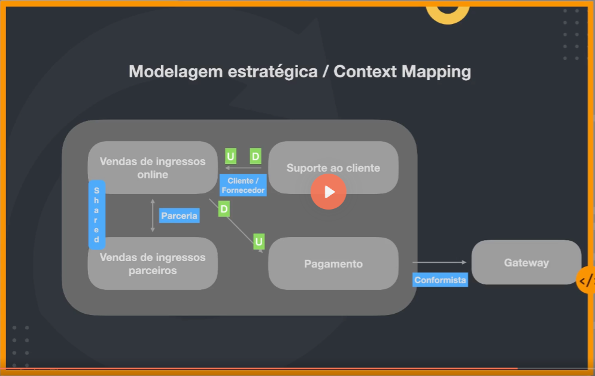

# DDD



## Entities

A unique thing (that can be distinguished) that can be continuously changed over time. It can be a person, car, city, etc. It is NOT a database table or an object from an ORM!!!!

<aside>
Avoid anemic entities (those that only have getters and setters, transporting data between application layers without containing business rules) that don't self-validate!

</aside>

## Value Objects

An object whose immutable attributes are the most important aspect. Example: address.

## Aggregate

A collection of associated objects that can be treated as a unit. Example: Order and Order Items.

## Bounded Contexts

Defines the boundary within which a specific domain model applies. Ensures that terms and concepts are consistent within this boundary, reducing complexity and ambiguity.

## Domain Events

Used to notify other bounded contexts about domain changes. Tipically, only aggregates should publish domain events.

```tsx
// domain-event-example.ts

// 1. Base Domain Event interface
interface DomainEvent {
  readonly occurredAt: Date;
  readonly name: string;
}

// 2. Concrete Domain Event
class UserRegistered implements DomainEvent {
  readonly occurredAt = new Date();
  readonly name = "UserRegistered";

  constructor(
    public readonly userId: string,
    public readonly email: string,
  ) {}
}

// 3. User Aggregate Root
class User {
  public readonly domainEvents: DomainEvent[] = [];

  constructor(
    public readonly id: string,
    public readonly email: string,
  ) {}

  static register(id: string, email: string): User {
    const user = new User(id, email);
    user.domainEvents.push(new UserRegistered(id, email));
    return user;
  }
}

// 4. Event Dispatcher
type EventHandler<T extends DomainEvent> = (event: T) => void;

class DomainEventDispatcher {
  private handlers: { [eventName: string]: EventHandler<any>[] } = {};

  register<T extends DomainEvent>(eventName: string, handler: EventHandler<T>) {
    if (!this.handlers[eventName]) {
      this.handlers[eventName] = [];
    }
    this.handlers[eventName].push(handler);
  }

  dispatch(event: DomainEvent) {
    const handlers = this.handlers[event.name] || [];
    handlers.forEach((handler) => handler(event));
  }

  dispatchAll(events: DomainEvent[]) {
    events.forEach((event) => this.dispatch(event));
  }
}

// 5. Setup: Register Listener
const dispatcher = new DomainEventDispatcher();

dispatcher.register("UserRegistered", (event: UserRegistered) => {
  console.log(`📨 Sending welcome email to ${event.email}`);
});

// 6. Simulate usage
const user = User.register("1", "harrison@example.com");
dispatcher.dispatchAll(user.domainEvents);
```
