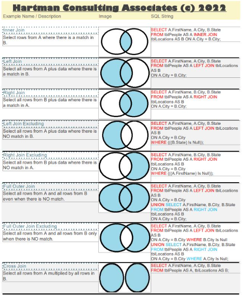

# Indexes

## 📦 Why Indexes Exist

A naive key-value database:

```bash
db_set key value
db_get key
```

Internally stores data like:

```
key,value
42,San Francisco
42,Exploratorium
```

To retrieve a value, the database may need to scan the whole file:

> ❌ O(n) lookup → too slow for large datasets

---

## 🧭 Solution: Indexes

An **index** is an additional structure that helps locate data quickly.

- Speeds up reads
- Slows down writes (because it must be maintained)
- Trades storage + complexity for performance

---

## 🔑 Hash Indexes (Simple Case)

A basic optimization is an **in-memory hash map**:

```
key → file offset
```

So lookup becomes:

1. Find key in hash map
2. Jump directly to disk offset
3. Read value

### ✔ Advantages

- Very fast reads
- Simple

### ❌ Limitations

- Must fit in memory
- No efficient range queries
- Not suitable for large key sets

---

## 📚 Log-Structured Storage (Foundation for Modern Indexes)

Instead of overwriting data:

- Always **append to a log file**
- Keep writes sequential (fast)

Example:

```
123, London
42, San Francisco
42, Exploratorium
```

### Key idea:

> New writes append; old values are ignored

---

## 🧹 Compaction

To avoid infinite growth:

- Remove duplicate keys
- Keep only latest value
- Merge segments

This creates **segment files**

---

## ⚡ SSTables (Sorted String Tables)

Now we improve logs:

> Store data sorted by key

```
handbag
handsome
handiwork
```

### Benefits

- Faster merging (like merge sort)
- Easier range queries
- Smaller indexes needed

---

## 🧠 Memtable + SSTable System

1. Writes go to **memtable (in-memory tree)**
2. When full → flush to disk as SSTable
3. Background compaction merges SSTables

---

## 🚀 Resulting system: LSM Tree

Used in:

- LevelDB
- RocksDB
- Cassandra
- HBase

### Characteristics:

- Fast writes
- Good compression
- Efficient range scans
- Background compaction required

---

## 🌳 B-Trees (Traditional Index Structure)

B-Trees store data differently:

### Structure:

- Fixed-size pages (e.g. 4KB)
- Tree of pages
- Each node has pointers to children

---

## 🔎 Lookup process

1. Start at root
2. Follow range boundaries
3. Reach leaf page
4. Retrieve value

---

## ✏️ Updates

- Modify page in place
- May split pages if full

---

## ⚠️ Reliability mechanisms

- Write-Ahead Log (WAL)
- Latches for concurrency control

---

## ✔ Advantages

- Very stable
- Efficient reads
- Great for transactional systems

## ❌ Limitations

- More random writes
- Page fragmentation
- Write amplification

---

## ⚔️ LSM Tree vs B-Tree

| Feature       | LSM Tree   | B-Tree     |
| ------------- | ---------- | ---------- |
| Writes        | Very fast  | Slower     |
| Reads         | Slower     | Faster     |
| Storage       | Efficient  | Fragmented |
| Compaction    | Required   | Not needed |
| Write pattern | Sequential | Random     |

---

## 🌍 Geospatial Indexing Problem

Now we extend indexes to 2D space:

> latitude + longitude

---

## ❌ Naive approach: 2D filtering

```sql
WHERE lat BETWEEN X AND Y
AND long BETWEEN A AND B
```

### Problem:

- Each filter returns large sets
- Must compute intersection
- Indexes work in 1D, not 2D

---

## 🧭 Geohash Approach (1D mapping of 2D space)

Geohash converts:

```
(lat, long) → string
```

Example:

```
u000, ezzz
```

---

## ✔ Key property: prefix similarity

### Figure 1.9: Shared prefix

Nearby locations often share prefix:

```
abc123
abc124
```

---

## ⚠️ Boundary Problem 1

Two close points may have **no shared prefix**:

- La Roche-Chalais → `u000`
- Pomerol → `ezzz`

Even though they are only 30km apart.

---

## ⚠️ Boundary Problem 2

Opposite issue:

> Long shared prefix but actually far apart

---

## 🧩 Solution: neighbor search

To fix this:

- Query current geohash cell
- Also query neighboring cells

---

## 📈 Expanding search problem

If not enough results:

### Option 1:

- Return only radius-limited results

### Option 2:

- Expand geohash precision
- Remove digits → larger region

---

## 🌳 Quadtree (Hierarchical space partitioning)

Instead of hashing, we split space:

- Divide world into 4 quadrants
- Recursively subdivide

---

## 🧠 Rule

Split until:

> each cell has ≤ N businesses (e.g. 100)

---

## 🧱 Structure

- Root = whole world
- Children = NW, NE, SW, SE
- Leaves = dense regions split further

---

## ✔ Advantages

- Adaptive resolution
- Dense areas → small cells
- Sparse areas → large cells

---

## ⚠️ Operational concerns

- Built in memory at startup
- Can take minutes for large datasets
- Needs careful deployment (blue/green)

---

## 🌐 Google S2 (Advanced geospatial system)

Instead of grid:

- Projects Earth onto sphere
- Uses Hilbert curve (space-filling curve)

### Key idea:

> Nearby points in 2D → close in 1D ordering

---

## ✔ Advantages

- Great for geofencing
- Flexible region queries
- High precision control (min/max levels)

---

## 🧠 Final intuition

All systems solve the same problem:

> Convert 2D spatial search into efficient 1D indexing

---

## 📌 Summary

| Technique  | Idea                        |
| ---------- | --------------------------- |
| Hash index | Direct lookup               |
| LSM tree   | Append + merge logs         |
| B-tree     | Balanced page tree          |
| Geohash    | Encode 2D → 1D string       |
| Quadtree   | Recursive spatial partition |
| S2         | Sphere → curve → 1D         |

---

# Databases

| Type                                | Workload / System Pattern                                                  | Description                                                                                          | Tradeoffs                                                                                                                  | Use Cases                                                                             | Examples                               | Key Takeaways                                                                      |
| ----------------------------------- | -------------------------------------------------------------------------- | ---------------------------------------------------------------------------------------------------- | -------------------------------------------------------------------------------------------------------------------------- | ------------------------------------------------------------------------------------- | -------------------------------------- | ---------------------------------------------------------------------------------- |
| **NewSQL Databases**                | Distributed OLTP with balanced read/write workloads and strong consistency | Combines SQL, ACID guarantees, and horizontal scalability using distributed architectures and MVCC.  | Excellent scalability and consistency, but operationally complex and sometimes immature compared to traditional RDBMS.     | Global transactional systems, financial platforms, real-time distributed applications | CockroachDB, Google Spanner            | Best for globally distributed transactional workloads requiring strong consistency |
| **Relational Databases**            | OLTP systems with structured, often read-heavy transactional workloads     | Structured schema with relationships, SQL querying, and ACID compliance.                             | Excellent consistency and querying capabilities, but harder to scale horizontally and less flexible for unstructured data. | ERP, CRM, banking systems, transactional business applications                        | PostgreSQL, MySQL                      | Best for structured data and transactional consistency                             |
| **Document Databases** (NoSQL)      | Read-heavy or mixed workloads with flexible schemas                        | Stores semi-structured JSON-like documents with schema flexibility and denormalized access patterns. | Fast development and scalability, but weaker relational modeling and potential data duplication.                           | CMS, product catalogs, user profiles, microservices                                   | MongoDB, CouchDB                       | Best for rapidly evolving semi-structured applications                             |
| **Time-series Databases** (NoSQL)   | Extremely write-heavy append-only telemetry workloads                      | Optimized for time-stamped data, sequential writes, compression, and retention policies.             | Extremely efficient for temporal data, but limited for relational or general-purpose querying.                             | Monitoring, IoT, forecasting, financial ticks                                         | InfluxDB, Prometheus, TimescaleDB      | Best for metrics, telemetry, and forecasting systems                               |
| **Graph Databases** (NoSQL)         | Read-heavy relationship traversal workloads                                | Models entities as nodes and edges for efficient relationship exploration.                           | Excellent for connected data, but harder to scale and less efficient for tabular analytics.                                | Social networks, recommendation engines, fraud detection                              | Neo4j, ArangoDB                        | Best for highly connected and relationship-centric data                            |
| **Key-Value Databases** (NoSQL)     | Ultra-low-latency read/write workloads                                     | Stores simple key-value pairs optimized for speed and scalability.                                   | Extremely fast and scalable, but limited querying and weak relational capabilities.                                        | Caching, sessions, gaming state, shopping carts                                       | Redis, Amazon DynamoDB                 | Best for caching and ultra-low-latency access                                      |
| **Wide-column Databases** (NoSQL)   | Massive-scale write-heavy distributed workloads                            | Stores data by columns for scalable distributed storage and high throughput.                         | Excellent scalability and ingestion performance, but more complex data modeling and weaker consistency in some systems.    | Event pipelines, IoT, messaging, large-scale analytics                                | Apache Cassandra, HBase                | Best for massive distributed workloads and high write throughput                   |
| **Data Warehouse / OLAP Databases** | Read-heavy analytical and aggregation workloads                            | Columnar systems optimized for large-scale analytical queries and BI processing.                     | Extremely fast for aggregations and analytics, but poor for transactional workloads and frequent small writes.             | BI, reporting, ML analytics, enterprise dashboards                                    | Snowflake, Google BigQuery, ClickHouse | Best for large-scale analytics and reporting                                       |
| **Search Engines**                  | Read-heavy indexing and text-search workloads                              | Specialized systems optimized for indexing, ranking, and full-text search.                           | Excellent search capabilities and aggregation support, but usually unsuitable as primary transactional storage.            | Product search, observability, log analytics, document indexing                       | Elasticsearch, Apache Solr             | Best for search, indexing, and observability systems                               |

---

## In-memory vs on-disk structures

## In-memory vs on-disk structures

| **Characteristic**        | **In-Memory**                                                                                                  | **On-Disk**                                                                                              |
| ------------------------- | -------------------------------------------------------------------------------------------------------------- | -------------------------------------------------------------------------------------------------------- |
| **Access speed**          | Nanoseconds                                                                                                    | Milliseconds (HDD) / Microseconds (SSD)                                                                  |
| **Random access**         | Very fast (O(1) pointer deref)                                                                                 | Expensive (requires separate I/O operation)                                                              |
| **Sequential access**     | Very fast (prefetching, CPU cache)                                                                             | Very fast (streaming reads/writes)                                                                       |
| **Best data structures**  | Hash Tables, AVL/Red-Black Trees, Heaps, Skip Lists, Binary Search Trees, Graph adjacency lists, Bloom Filters | B-Trees, B+ Trees, LSM-Trees, SSTables, Heap files, Sorted runs, ISAM (Indexed Sequential Access Method) |
| **Persistence**           | No                                                                                                             | Yes                                                                                                      |
| **Update pattern**        | Frequent in-place updates (O(1) or O(log n))                                                                   | Append-only or batched updates (minimize random I/O)                                                     |
| **Write pattern**         | Random writes are fine                                                                                         | Sequential writes preferred (write-ahead logs, compaction)                                               |
| **Compression**           | Optional (CPU can handle decompression cheaply)                                                                | Common (reduces I/O and disk footprint)                                                                  |
| **Concurrency control**   | Fine-grained locks or lock-free (CAS, atomic ops)                                                              | Coarse-grained locking, transaction logs, journaling                                                     |
| **Caching strategy**      | CPU cache, LRU in-memory cache                                                                                 | Buffer pool, page cache                                                                                  |
| **Examples of systems**   | Redis, Memcached, Spark (in-memory RDDs), in-memory databases (H2, HSQLDB)                                     | PostgreSQL, MySQL, LevelDB, RocksDB, Cassandra                                                           |
| **Algorithms suited for** | Dijkstra’s, A\*, in-memory sort (QuickSort, MergeSort in RAM)                                                  | External merge sort, external hash join, MapReduce shuffle/sort                                          |
| **Indexing**              | In-memory hash index, radix tree (Trie), segment tree                                                          | B+ Tree index, LSM index, bitmap index                                                                   |
| **Search complexity**     | O(1) or O(log n) — negligible I/O cost                                                                         | O(logB n) — each node fetch = disk I/O                                                                   |
| **Durability**            | Lost on restart unless checkpointed                                                                            | Persistent; journaling ensures crash recovery                                                            |

---

## SQL Joins and Query Design



SQL JOINs are fundamental operations for combining data from multiple tables in relational queries. Different join types (INNER, LEFT, RIGHT, FULL, CROSS) determine which rows are included in the result set based on matching conditions between tables.

---
