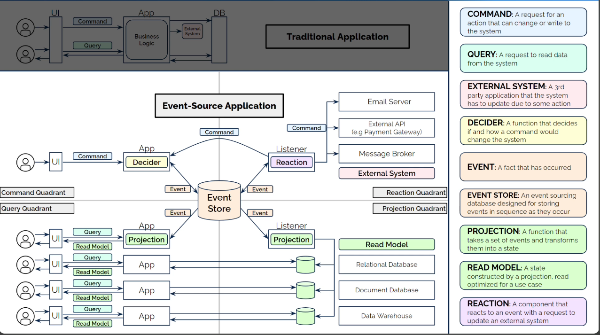
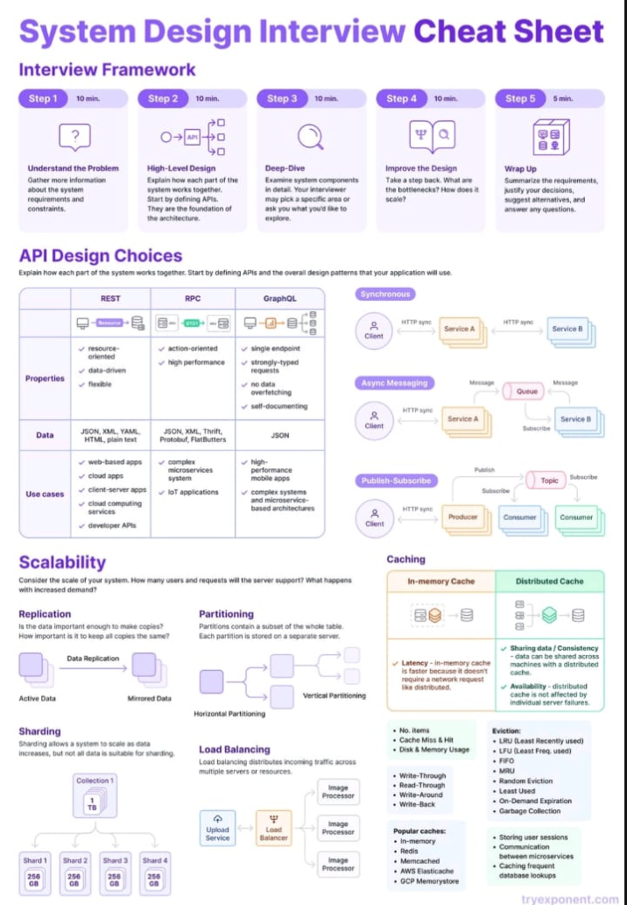
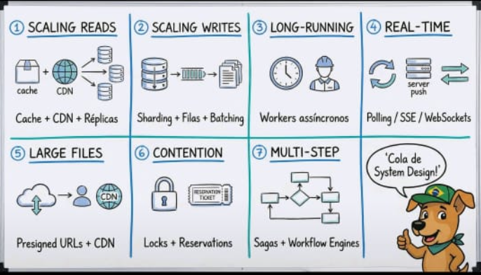

# EDA

## Introduction

Event-driven architecture is a software design pattern that allows decoupled applications to asynchronously publish and subscribe to events.

## Working with events

There are many forms of working with events:

- Event sourcing: You have a representation of the current state of the world, but you also have a log of all the events happened.
- CQRS: You separate the components that read and write to your permanent store.
- Event notification (can be also called, delta events): details a change between one state to another `{"pedido": "1", "status": "aprovado"}` . Good for consumers react to changes. Poor if consumers need the full state.
- Event-carried state transfer (also called facts):

```
{"pedido": "1", "status": "aprovado", "data": "2023-10-01", "valor": 100.00, "cliente": {"nome": "João", "email": "joao@gmail.com", "telefone": "123456789"}, "produtos": [{"id": 1, "nome": "Produto A", "quantidade": 2, "preco_unitario": 50.00}, {"id": 2, "nome": "Produto B", "quantidade": 1, "preco_unitario": 100.00}]}
```

## Event sourcing



## Kafka x RabbitMQ

<aside>

Use **Kafka** when you need **durable, replayable event streams** with **high throughput** and **horizontal scalability**—for example, audit logs, analytics pipelines, event sourcing, or asynchronous microservice communication at scale. Kafka excels when messages must be retained for long periods, reprocessed later, or fanned out to many independent consumers.

Use **RabbitMQ** when you need **immediate, short-lived task handling** or **request–reply style communication**—for example, background job dispatch, command queues, or notification systems. It shines when low latency, strong **configurable** delivery guarantees, and simpler operational setup matter more than throughput or event retention. In short, Kafka is for **streams of facts over time**, while RabbitMQ is for **commands to be done right now**.

</aside>

| **Feature**                | **Apache Kafka**                                                                  | **RabbitMQ**                                                                        |
| -------------------------- | --------------------------------------------------------------------------------- | ----------------------------------------------------------------------------------- |
| **Type**                   | Distributed event streaming platform (log-based, stream-oriented)                 | Traditional message broker with optional stream capabilities                        |
| **Primary Abstraction**    | Immutable event log                                                               | Smart broker with queues and routing                                                |
| **Architecture**           | Pub/Sub with distributed commit log                                               | Traditional message broker with queues and exchanges                                |
| **Message Model**          | Pull-based (consumer-driven fetch with long polling)                              | Push-based (messages delivered to consumers)                                        |
| **Consumption Model**      | Non-destructive read (messages remain after consumption)                          | Destructive consumption by default (removed after acknowledgment)                   |
| **Ordering**               | Strong ordering within a partition; global ordering reduces scalability           | Queue ordering preserved unless parallel consumption or redelivery occurs           |
| **Durability**             | High (data persisted on disk by default)                                          | Configurable (persistent queues or transient)                                       |
| **Throughput**             | Very high (millions of messages/sec)                                              | Moderate to high (lower than Kafka generally). Moderate data volumes                |
| **Latency**                | Low for large throughput, slightly higher per message                             | Low for individual messages                                                         |
| **Message Retention**      | Configurable retention (time-based, size-based, or infinite). Replay-native       | Traditionally removes after ack; Streams plugin supports retention and replay       |
| **Reprocessing / Replay**  | Native replay from offsets                                                        | Classic queues: no replay after ack. Streams: replay supported                      |
| **Data Storage**           | Distributed append-only persistent log                                            | Queue-based broker; Streams use append-only log internally                          |
| **Scalability**            | Horizontally scalable with partitions and brokers                                 | Scales vertically and via clustering/federation                                     |
| **Backpressure**           | Disk-backed retention naturally absorbs bursts                                    | Broker-mediated flow control; queues can grow under sustained overload              |
| **Broker Responsibility**  | Lightweight broker; consumers manage offsets and retries                          | Broker manages routing, acknowledgments, retries, and DLQs                          |
| **Consumer Pattern**       | Independent consumers track offsets; consumer groups share partitions             | Competing consumers on queues; fanout via exchanges                                 |
| **Fanout / Multiconsumer** | Multiple consumers independently replay the same immutable stream                 | Exchanges duplicate messages into queues for each consumer group                    |
| **Protocol Support**       | Kafka protocol, REST, some connectors                                             | AMQP, MQTT, STOMP, HTTP, WebSockets, etc.                                           |
| **Transactions**           | Supported (exactly-once semantics possible)                                       | Supported (publisher confirms preferred; transactions are costly)                   |
| **Use Cases**              | Event sourcing, streaming analytics, CDC, log aggregation, replayable pipelines   | Task distribution, RPC, workflows, low-latency command processing                   |
| **Complexity**             | Higher (setup, maintenance, scaling)                                              | Lower (easier to deploy and manage)                                                 |
| **Latency Sensitivity**    | Low and stable at high throughput; slightly higher per message due to batching    | Better suited for low-latency workloads                                             |
| **Developer Ecosystem**    | Rich (Kafka Streams, Kafka Connect, kSQL)                                         | Broad language support and plugins                                                  |
| **Error Handling**         | Mostly consumer responsibility (retries, DLQs implemented at app/framework level) | Easier since the broker manages most of the lifecycle (DLQs, backpressure, retries) |
| **Delivery Semantics**     | At-least-once, at-most-once, exactly-once                                         | At-most-once and at-least-once (manual acks)                                        |
| **High Availability**      | Built-in replication via partitions                                               | Clustering and mirrored queues for HA                                               |
| **Monitoring**             | Requires external tools (Prometheus, Grafana, Confluent Control Center)           | Built-in management UI and metrics out of the box                                   |
| **Security**               | SASL, TLS, ACLs (broker and topic level)                                          | TLS, user/password, vhosts, fine-grained permissions                                |
| **Message Size**           | Optimized for large volumes of small to medium messages                           | Handles smaller messages best; large payloads impact performance                    |
| **Deployment Options**     | Kafka OSS, Confluent Cloud, AWS MSK                                               | RabbitMQ OSS, CloudAMQP, AWS MQ                                                     |
| **Not Ideal For**          | Real-time RPC, fine-grained per-message ordering                                  | Persistent event sourcing or analytics pipelines                                    |
| **Typical Latency**        | ~5–50 ms typical (batching, replication, and config dependent)                    | < 1 ms to a few ms per message                                                      |




