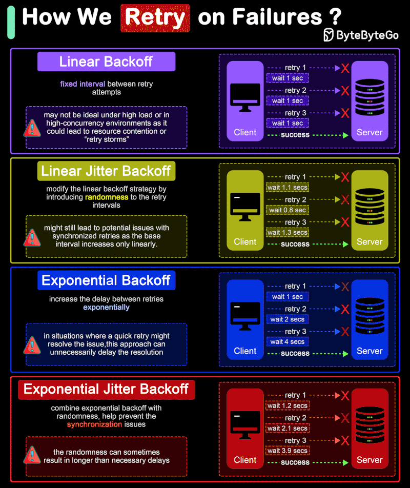

# EDA

## Introduction

Event-driven architecture is a software design pattern that allows decoupled applications to asynchronously publish and subscribe to events.

## Working with events

There are many forms of working with events:

- Event sourcing: You have a representation of the current state of the world, but you also have a log of all the events happened.
- CQRS: You separate the components that read and write to your permanent store.
- Event notification (can be also called, delta events): details a change between one state to another `{"pedido": "1", "status": "aprovado"}` . Good for consumers react to changes. Poor if consumers need the full state.
- Event-carried state transfer (also called facts):

```
{"pedido": "1", "status": "aprovado", "data": "2023-10-01", "valor": 100.00, "cliente": {"nome": "João", "email": "joao@gmail.com", "telefone": "123456789"}, "produtos": [{"id": 1, "nome": "Produto A", "quantidade": 2, "preco_unitario": 50.00}, {"id": 2, "nome": "Produto B", "quantidade": 1, "preco_unitario": 100.00}]}
```

## Event sourcing


## Kafka x RabbitMQ

<aside>

Use **Kafka** when you need **durable, replayable event streams** with **high throughput** and **horizontal scalability**—for example, audit logs, analytics pipelines, event sourcing, or asynchronous microservice communication at scale. Kafka excels when messages must be retained for long periods, reprocessed later, or fanned out to many independent consumers.

Use **RabbitMQ** when you need **immediate, short-lived task handling** or **request–reply style communication**—for example, background job dispatch, command queues, or notification systems. It shines when low latency, strong **configurable** delivery guarantees, and simpler operational setup matter more than throughput or event retention. In short, Kafka is for **streams of facts over time**, while RabbitMQ is for **commands to be done right now**.

</aside>

| **Feature** | **Apache Kafka** | **RabbitMQ** |
| --- | --- | --- |
| **Type** | Distributed streaming platform (log-based) | Message broker (traditional, queue-based) |
| **Architecture** | Pub/Sub with distributed commit log | Traditional message broker with queues |
| **Message Model** | Pull-based (consumer-driven fetch with long polling) | Push-based (messages delivered to consumers) |
| **Ordering** | Guaranteed per partition | Ordering per queue; may break with multiple consumers, redelivery, or prefetch |
| **Durability** | High (data persisted on disk by default) | Configurable (persistent queues or transient) |
| **Throughput** | Very high (millions of messages/sec) | Moderate to high (lower than Kafka generally). Moderate data volumes |
| **Latency** | Low for large throughput, slightly higher per message | Low for individual messages |
| **Message Retention** | Configurable (time-based, size-based, or forever). Enables replay | Once delivered and acknowledged, it's removed |
| **Scalability** | Horizontally scalable with partitions and brokers | Scales vertically and via clustering/federation |
| **Backpressure** | Handled via consumer lag (disk-backed logs absorb pressure) | Can cause queues to fill and memory pressure |
| **Ordering Guarantee** | Within partition | Within a queue |
| **Protocol Support** | Kafka protocol, REST, some connectors | AMQP, MQTT, STOMP, HTTP, WebSockets, etc. |
| **Transactions** | Supported (exactly-once semantics possible) | Supported (publisher confirms preferred; transactions are costly) |
| **Use Cases** | Event streaming (continuous), big data pipelines, analytics, logs | Task queues, RPC, request/response, workflows. Sporadic bursts of messages |
| **Complexity** | Higher (setup, maintenance, scaling) | Lower (easier to deploy and manage) |
| **Latency Sensitivity** | Low and stable at high throughput; slightly higher per message due to batching | Better suited for low-latency workloads |
| **Developer Ecosystem** | Rich (Kafka Streams, Kafka Connect, kSQL) | Broad language support and plugins |
| **Error Handling** | Mostly consumer responsibility (retries, DLQs implemented at app/framework level) | Easier since the broker manages most of the lifecycle (DLQs, backpressure, retries) |
| **Delivery Semantics** | At-least-once, at-most-once, exactly-once | At-most-once and at-least-once (manual acks) |
| **Reprocessing / Replay** | Native (consume from any offset) | Not natively supported — messages are gone after ack |
| **High Availability** | Built-in replication via partitions | Clustering and mirrored queues for HA |
| **Data Storage** | Persistent log, append-only | Memory-first with disk persistence support (performance degrades when disk-bound) |
| **Monitoring** | Requires external tools (Prometheus, Grafana, Confluent Control Center) | Built-in management UI and metrics out of the box |
| **Security** | SASL, TLS, ACLs (broker and topic level) | TLS, user/password, vhosts, fine-grained permissions |
| **Message Size** | Optimized for large volumes of small to medium messages | Handles smaller messages best; large payloads impact performance |
| **Consumer Pattern** | Stream processors or consumer groups (shared partitions) | Competing consumers per queue |
| **Fanout / Multiconsumer** | Native fanout (multiple consumers read same topic independently) | Possible via exchanges, but duplicates messages per queue |
| **Deployment Options** | Kafka OSS, Confluent Cloud, AWS MSK | RabbitMQ OSS, CloudAMQP, AWS MQ |
| **Best For** | High-throughput, replayable event streams, strong ordering. Immutable event log (history of facts) | Real-time task execution, short-lived commands. Work queue / message routing |
| **Not Ideal For** | Real-time RPC, fine-grained per-message ordering | Persistent event sourcing or analytics pipelines |
| **Typical Latency** | ~5–50 ms typical (batching, replication, and config dependent) | < 1 ms to a few ms per message |



