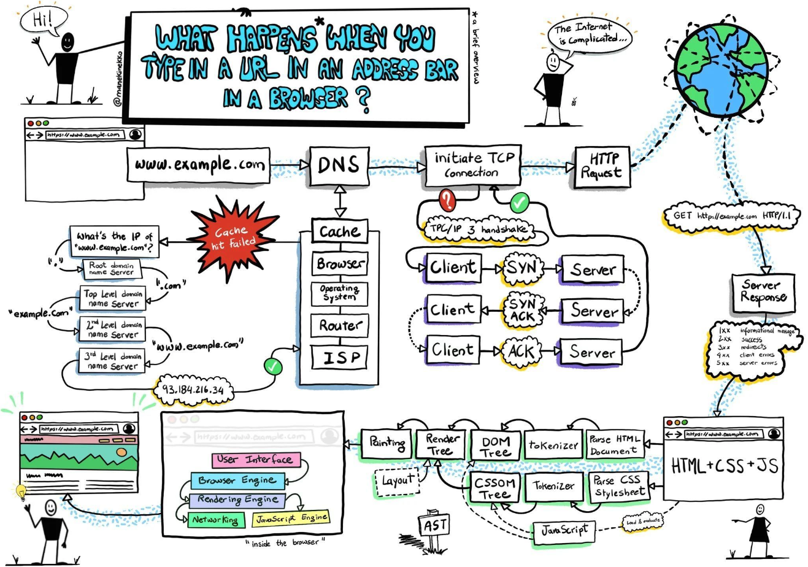

# Distributed Systems Fundamentals

## The Core Problem

Distributed systems are fundamentally different from single-machine programs because they must deal with:

- **Partial failures** — some components fail while others continue
- **Unreliable networks** — no delivery or timing guarantees
- **Unreliable clocks** — time is approximate, not exact
- **Uncertain knowledge about system state** — no node has complete global view

Unlike local programs, distributed systems **cannot always distinguish** between:

- a slow node
- a crashed node
- a lost packet
- or a delayed response

---

## Single-Machine vs Distributed Systems

Single computers usually behave deterministically:

- Either working
- Or completely crashed

Distributed systems introduce:

- **Partial failures** — independent component failures
- **Nondeterministic behavior** — timing uncertainty
- **Uncertainty** — incomplete information about system state

A component may fail while the rest of the system continues working.

---

## Why Distributed Systems Are Hard

Failures can happen anywhere:

- Power outages
- Switch failures
- Network partitions
- Hardware failures
- Misconfigurations
- Human error

The key challenge:

> **You often cannot know whether an operation succeeded or failed.**

This fundamental uncertainty drives all distributed system design.

---

## Cloud Systems vs Supercomputers (HPC)

### Supercomputers (HPC)

Typically:

- Specialized hardware
- Tightly coupled systems
- **Fail-stop behavior** — failures are immediate and clear
- Checkpoint/restart recovery model
- If one node fails → entire job often stops

### Cloud Systems

Typically:

- Commodity hardware
- Shared-nothing architecture
- Unreliable networks
- Geographically distributed
- Online/always available requirement

Must tolerate:

- Node failures
- Rolling upgrades
- Partial outages
- Arbitrary delays

This leads to the need for:

- Redundancy
- Replication
- Fault tolerance
- Consensus mechanisms

---

## Building Reliable Systems from Unreliable Parts

Important principle:

> **Reliability can emerge from unreliable components.**

Examples:

- TCP built on unreliable IP (retransmission, ordering, flow control)
- Error-correcting codes over noisy channels
- Replication with quorums tolerates minority failures

But:

- Guarantees are never perfect
- Only probabilistically improved
- Increased complexity in failure scenarios

---

# Faults and Partial Failures

## Main Concepts

### Partial Failures

In distributed systems, partial failures mean:

- One component crashes
- Others continue operating
- System enters inconsistent or degraded state
- Detecting which component failed is uncertain

Example: A producer sends a message to a broker. Did it arrive?

- Message lost in network?
- Broker crashed before processing?
- Broker processed but crashed before replying?
- Network delay masking broker success?

The producer cannot distinguish these cases without additional mechanisms.

---

## Key Challenge

The defining characteristic of distributed systems:

> **Quoting this fundamental principle is essential for all distributed design decisions.**

You often cannot know:

- If an operation succeeded
- If a node is alive or dead
- What order events occurred in
- What the current state actually is

---

# Unreliable Networks

## Shared-Nothing Architecture (Mostly L3-L7)

Machines communicate **only through networks**:

- No shared memory
- No shared disk
- No shared state

The network becomes:

> **The critical dependency of the entire system.**

Network failure = system failure.

---

## Asynchronous Packet Networks (Primarily L3)

Internet and datacenter networks provide:

- **No delivery guarantees** — packets may be lost
- **No timing guarantees** — arrival time is unpredictable
- **No bounded delays** — wait time can be arbitrarily long

Possible outcomes when sending a request:

1. Request lost in network
2. Request delayed in queue
3. Request delivered, node processing slowly
4. Request processed, response lost
5. Response delayed
6. Remote node crashed
7. Remote node paused (GC, scheduler pause)

The sender cannot distinguish between these cases.

---

## The Timeout Problem (L4/L7)

Because failures are ambiguous, systems rely on **timeouts**.

But timeout selection is difficult:

- **Short timeout** → false positives (treating slow nodes as dead)
- **Long timeout** → slow recovery, poor responsiveness

Incorrect timeouts trigger:

- Cascading failures
- Duplicate work
- Retry amplification
- Overload amplification

Example:

- If timeouts are too aggressive, a slow leader gets demoted
- Multiple nodes think they're the leader
- Split brain corruption occurs

---

## Network Congestion and Queueing (L2-L4 and L7)

Most delays come **not from physical distance** but from:

- Switch queues
- Overloaded CPUs
- VM pauses
- TCP retransmissions
- Backpressure from downstream systems

Key insight:

> **Delays are usually caused by queueing, not physical distance.**

Latency is highly variable, especially under load.

---

## TCP vs UDP (Transport Layer, L4)

### TCP (L4)

Provides:

- Retransmission (automatic retry on loss)
- Ordering (packets arrive in order)
- Flow control (prevents overwhelming receiver)
- Connection-oriented handshake

Trade-off:

- Introduces variable latency
- Retransmissions cause unpredictable delays
- Queuing at both sender and receiver

---

### UDP (L4)

Provides:

- Low latency
- No retransmission (fire-and-forget)
- No ordering guarantees
- No connection setup

Trade-off:

- Application must handle losses
- Out-of-order delivery possible
- Message duplication possible

Useful when:

- Delayed data is worthless (VoIP, live video)
- One-way communication acceptable
- Timeliness > reliability

---

## Synchronous vs Packet-Switched Networks (L1-L3)

### Synchronous Networks

(e.g., telephone circuits, dedicated leased lines)

Provide:

- Reserved bandwidth
- Bounded latency (maximum delay guaranteed)
- Predictable delivery
- Consistent performance

Trade-off:

- Expensive
- Inefficient for bursty traffic
- Less common in modern cloud systems

---

### Packet-Switched Networks

(the internet, modern datacenters)

Provide:

- Better resource utilization
- Dynamic sharing of links
- Efficient handling of bursts
- Lower cost

Trade-off:

- Unbounded delays
- Unpredictable latency
- Variable performance

Key principle:

> **Tradeoff: Predictability vs Resource Utilization**

Most systems choose packet-switched and build fault tolerance around its unpredictability.

---

## Network Routing Stability and Flap Damping (L3)

### What Is Route Flapping?

Route flapping happens when a route repeatedly oscillates between available and unavailable states.

Common causes:

- Unstable physical links
- Interface resets
- Intermittent provider outages
- Misconfigured BGP advertisements

Impact:

- Routing table churn
- Increased control-plane CPU load
- Slower convergence
- Cascading reachability issues

---

### Flap Damping in BGP

Flap damping is a suppression mechanism that penalizes unstable routes.

Typical model:

1. Each flap adds a penalty (example: 1000 points)
2. Penalty decays exponentially over time (example half-life: 15 minutes)
3. If penalty exceeds suppress threshold (example: 2000), route is suppressed
4. Route is reused only after penalty decays below reuse threshold (example: 750)

Example:

- 3 fast flaps -> penalty about 3000
- Route becomes suppressed
- Decay eventually drops penalty below reuse threshold
- Route can be announced again

This improves global stability, but can delay recovery for routes that become healthy quickly.

---

### When to Use It

Useful when:

- You operate BGP-heavy environments with persistent route oscillation
- Instability causes recurring churn and convergence storms

Use carefully when:

- Routes flap briefly during maintenance windows
- Low-latency recovery is more important than suppressing noisy routes

Modern context:

- Some operators reduce or disable aggressive damping because older defaults could over-penalize prefixes.
- The design principle still matters: reduce control-plane noise without harming recovery.

---

## OSI Quick Reference for This Document

- **L1 (Physical):** cables, optics, radio links
- **L2 (Data Link):** frames, MAC, switches, local queueing
- **L3 (Network):** IP routing, BGP, route propagation, flap damping
- **L4 (Transport):** TCP/UDP, retransmission, flow control, timeouts
- **L5-L7 (Session/Presentation/Application):** TLS sessions, HTTP, APIs, gateways, business protocols

---

# Unreliable Clocks

## Why Clocks Matter

Distributed systems use time for:

- **Timeouts** — detecting failures
- **Metrics** — understanding performance
- **Ordering** — determining which event happened first
- **Expiration** — invalidating leases, tokens, caches
- **Scheduling** — running jobs at specific times
- **Logging** — debugging and auditing

But **clocks are unreliable**.

---

## The Clock Synchronization Problem

All distributed systems assume clocks are roughly synchronized using NTP (Network Time Protocol).

But NTP is imperfect:

- Clocks drift at different rates
- Network delays slow synchronization
- NTP servers can be wrong or lie
- Leap seconds cause bugs
- During network partitions, clocks diverge
- System clocks can be manually adjusted

Clock synchronization is:

> **Approximate, never exact.**

---

## Two Types of Clocks

### 1. Time-of-Day Clocks

Examples:

- `System.currentTimeMillis()` (Java)
- `time.time()` (Python)
- `Date.now()` (JavaScript)

Properties:

- Synchronized via NTP to calendar time
- Represent absolute time
- Affect absolute timestamps

Problems:

- **Can jump backward** — NTP adjustment, manual change, leap second
- Affected by leap seconds causing bugs
- **Unsuitable for measuring durations** — if you measure elapsed time and clock jumps back, elapsed time appears negative

### 2. Monotonic Clocks

Examples:

- `System.nanoTime()` (Java)
- `time.monotonic()` (Python)
- `performance.now()` (JavaScript)

Properties:

- Only move forward
- Suitable for measuring elapsed time
- Immune to NTP adjustments
- Not affected by leap seconds

Limitations:

- **Cannot compare across machines** — different clocks have different starting points
- Unsuitable for absolute timestamps
- Only meaningful within a single machine

---

## Practical Consequence: Fencing Tokens

When using timestamps for distributed locks:

**Dangerous pattern:**

```
Node A acquires lock with lease until time T
Node A pauses
Clock jumps forward
Lease expires
Node B acquires same lock
Node A resumes and thinks it still owns lock
→ Both nodes think they own lock → corruption
```

**Solution:**

Use monotonically increasing **fencing tokens** instead of timestamps:

```
Lock acquisition 1 → token = 1
Lock acquisition 2 → token = 2
Lock acquisition 3 → token = 3

Server only accepts operations from highest token
Stale leaders cannot corrupt state
```

---

# Process Pauses and Garbage Collection

## Nodes May Pause Without Failing

A node can become unresponsive without actually crashing:

Causes:

- **Garbage collection** (especially long GC pauses in JVM)
- **Page faults** (memory swapped to disk)
- **Scheduler delays** (OS context switching, high load)
- **Virtualization** (VM pause on oversubscribed host)
- **CPU starvation** (container/cgroup limits)

From the network perspective:

> **A paused node appears identical to a dead node.**

---

## False Failure Detection

When a node pauses:

- Heartbeats stop
- Other nodes detect timeout
- Node assumed dead
- Other nodes take over its responsibilities

When the node resumes:

- It may still believe it owns resources
- Corruption or duplicated actions occur
- Two leaders both think they're in charge → split brain

---

## Example: GC Pauses in JVM Systems

If a JVM pauses for a long garbage collection:

1. Heartbeats stop
2. Node declared dead
3. Node loses leadership
4. New leader elected by other nodes
5. JVM resumes after pause
6. Old leader resumes execution
7. **Both leaders may execute conflicting operations**
8. Distributed lock violated, data corrupted

This is why:

- Distributed locks need fencing tokens
- Leases must be carefully managed
- Long GC pauses are dangerous in consensus systems

---

# Knowledge, Truth, and Lies

## The Fundamental Problem

In distributed systems:

> **No node has complete knowledge of global state.**

Each node only observes:

- **Delayed messages** — responses from other nodes take time
- **Local clocks** — unreliable and cannot be compared across machines
- **Local state** — what it has processed locally
- **Partial information** — incomplete view of system

This creates fundamental uncertainty about what is true.

---

## Failure Detection is Uncertain

A node declared "dead" by the system may actually be:

- **Alive but slow** — temporarily unresponsive, will recover
- **Partitioned** — network broken, cannot communicate
- **Actually crashed** — machine down, permanently offline
- **Paused** — GC or scheduler delayed, will resume

Distributed systems **cannot know for certain** which case it is.

---

## Quorum and Suspicion

Instead of knowing truth, distributed systems work with:

- **Suspicion** — nodes suspect other nodes failed
- **Probabilities** — increased confidence over time
- **Leases** — time-bounded trust
- **Quorum assumptions** — "if majority says X died, probably true"

Key principle:

> **Nodes are not "known dead" — they are "suspected of failure".**

---

## Membership Protocols (SWIM and Gossip)

Membership protocols maintain cluster views and support failure detection at scale.

### SWIM (Scalable Weakly-consistent Infection-style Membership)

Core ideas:

- Each node periodically probes a random peer
- If direct probe fails, node asks indirect peers to probe (indirect ping)
- Nodes spread membership updates using gossip
- Failures move through states like **alive -> suspect -> dead**

Why it works well:

- Decentralized (no single coordinator)
- Constant-size probing work per node per round
- Scales to large clusters with bounded overhead

Typical uses:

- Service discovery and health membership in large fleets
- Consul-style cluster membership

---

### Gossip-Based Membership

Gossip protocols disseminate membership state probabilistically:

- Nodes periodically exchange partial views
- Updates spread epidemically through the cluster
- Convergence is eventually consistent

Strengths:

- Highly fault tolerant
- Easy horizontal scale
- Handles frequent node churn

Trade-off:

- Temporary view divergence is expected
- Membership accuracy converges over time rather than instantly

Examples:

- Cassandra-style peer dissemination
- Akka cluster membership dissemination

---

### Comparison

| Approach                      | Detection Model                                 | Overhead Pattern                                | Consistency of View                                    | Failure Mode Risk                                       |
| ----------------------------- | ----------------------------------------------- | ----------------------------------------------- | ------------------------------------------------------ | ------------------------------------------------------- |
| Centralized heartbeat manager | Single observer and heartbeat timeout           | Central bottleneck grows with cluster size      | Fast if manager healthy                                | Single point of failure and overload                    |
| Generic gossip membership     | Probabilistic peer exchange                     | Distributed, typically moderate per round       | Eventual consistency                                   | Temporary divergence during churn                       |
| SWIM-style membership         | Direct + indirect probes + gossip dissemination | Constant probing work per node + gossip updates | Eventual consistency with strong practical convergence | False suspicions still possible under severe partitions |

Key takeaway:

> **In distributed systems, membership is usually probabilistic and suspicion-based, not absolute truth.**

---

## Byzantine Faults vs Crash Faults

### Crash Faults (Non-Byzantine)

Assumptions:

- Nodes fail **accidentally, not maliciously**
- Failed nodes simply stop responding
- No corruption or lying

Examples:

- Hardware failure
- Software crash
- Network partition
- Resource exhaustion

Handled by:

- Replication
- Consensus algorithms (Paxos, Raft)
- Quorum systems
- Simple timeout mechanisms

---

### Byzantine Faults

Assumptions:

- Nodes can fail **arbitrarily and maliciously**
- Nodes may lie, corrupt data, send contradictory messages
- Nodes may delay, reorder, or fabricate messages
- Attackers coordinate attacks

Characteristics:

- Far more difficult to tolerate
- Requires mechanisms like:
  - Cryptographic signatures
  - Byzantine consensus algorithms (PBFT)
  - Majority > 2/3 (instead of > 1/2)
  - Voting and verification

When Byzantine matters:

- **Financial systems** — dishonest nodes may steal
- **Cryptocurrencies** — untrusted peer networks
- **Military/aerospace systems** — adversarial environments
- **Security-critical systems** — protection against sabotage

When Byzantine doesn't matter:

- **Typical datacenter** — nodes owned by same organization
- **Cloud infrastructure** — hyperscaler controls hardware
- **Internal systems** — no external adversaries
- **Crash fault tolerance sufficient** — easier to implement

**Practical distinction:**

Most distributed systems (databases, message brokers, cloud infrastructure) assume crash faults and use simpler consensus algorithms. Byzantine resilience is reserved for cryptocurrency, satellite systems, and adversarial networks.

---

# System Models and Assumptions

Different distributed systems are designed for different **failure models** and **timing assumptions**.

---

## Synchronous Model

Assumes:

- **Bounded message delays** — messages arrive within max time D
- **Bounded processing time** — nodes process messages within time P
- **Bounded clock drift** — clocks drift by at most r

Implications:

- If no response within D+P+margin → node is definitely dead
- Can implement reliable failure detection
- Can guarantee safety properties

Reality:

- **Very strong assumptions**
- **Rarely true in practice**
- Real systems have unbounded delays

---

## Partially Synchronous Model

Most realistic model:

- Usually behaves synchronously
- Occasionally experiences:
  - Long pauses
  - Network partitions
  - Extreme spikes in latency
  - Unexpected delays

Characteristics:

- Most algorithms designed for this model
- Assumes synchrony usually, but not always
- Practical consensus algorithms (Raft, Paxos) work here

---

## Asynchronous Model

Assumes:

- **No timing guarantees at all**
- Messages can be arbitrarily delayed
- Nodes can be arbitrarily slow

Implications:

- Impossible to reliably distinguish slow from dead
- Cannot implement reliable failure detection
- Many algorithms impossible to solve

Famous result:

> **FLP Impossibility Theorem** — Consensus is impossible in asynchronous systems with even one crash fault

---

# Safety vs Liveness

Two foundational properties:

## Safety

"**Nothing bad happens.**"

Examples:

- No duplicate transaction execution
- No split brain (only one leader)
- No data corruption
- Invariants always hold

Characteristics:

- Violations are **catastrophic**
- Once violated, cannot be recovered
- Systems prioritize safety

---

## Liveness

"**Something good eventually happens.**"

Examples:

- Requests eventually complete
- Leader election eventually succeeds
- A recovered node eventually rejoins
- Progress continues despite failures

Characteristics:

- Temporary failures acceptable
- Can recover
- Systems sometimes sacrifice liveness for safety

---

## CAP and Partition Behavior

During a network partition, systems must choose:

- **Consistency** (safety) — maintain correctness
- **Availability** (liveness) — continue serving requests

Most systems choose:

> **Partition over Availability (CP)**
>
> Preserve safety, sacrifice liveness

Rationale:

- Data corruption worse than downtime
- Better to be consistent and unavailable
- Users prefer "service down" to "wrong data"

---

---

# App server vs Web server vs Proxy server vs Reverse proxy vs Gateway vs Load balancer

| Concept                          | Primary Purpose                      | Typical Position / OSI Layer                   | Traffic Direction            | Routing Capabilities         | Common Features                                      | Statefulness                 | Examples                     |
| -------------------------------- | ------------------------------------ | ---------------------------------------------- | ---------------------------- | ---------------------------- | ---------------------------------------------------- | ---------------------------- | ---------------------------- |
| **Web Server**                   | Serve web content and terminate HTTP | Edge or app-adjacent • Mostly L7 (Application) | Client → server              | Basic URL/path routing       | Static files, TLS, compression, caching              | Usually stateless            | NGINX, Apache, IIS           |
| **Application Server**           | Execute business/application logic   | Core backend • L7 (Application)                | Client → app logic           | Application-defined routing  | Business logic, DB access, transactions              | Can be stateless or stateful | Spring Boot, Django, Node.js |
| **Proxy Server (Forward Proxy)** | Forward outbound client traffic      | Client-side intermediary • L4/L7               | Client → external internet   | Simple forwarding/filtering  | Caching, anonymity, filtering                        | Usually stateless            | Squid, Privoxy               |
| **Reverse Proxy**                | Front internal services/apps         | Edge or ingress layer • Mostly L7              | Internet → internal services | Advanced HTTP routing        | TLS termination, caching, auth, rewrites             | Usually stateless            | NGINX, Envoy, Traefik        |
| **API Gateway**                  | Manage and orchestrate APIs          | API boundary / edge • L7 (Application)         | Client → APIs/microservices  | API-aware routing            | OAuth, rate limiting, observability, transformations | Usually stateless            | Kong, Tyk, Apigee            |
| **Load Balancer**                | Distribute traffic across instances  | Front of server pools • L4 and/or L7           | Client → server pool         | Traffic distribution-focused | Health checks, failover, balancing algorithms        | Stateless                    | AWS ALB/NLB, HAProxy, F5     |

### 1. Reverse Proxy vs Load Balancer

This is the biggest conceptual overlap.

A reverse proxy can:

- load balance
- cache
- terminate TLS
- rewrite requests
- authenticate users

A load balancer can:

- reverse proxy traffic
- terminate TLS
- do path-based routing

Modern infrastructure blurred the boundary.

Example:

- [Envoy Proxy](https://www.envoyproxy.io/?utm_source=chatgpt.com) acts simultaneously as:
  - reverse proxy
  - service mesh proxy
  - load balancer
  - API edge

---

### 2. Application Servers Are Not Necessarily Stateful

Historically:

- Java EE servers (JBoss, WebLogic) tightly managed sessions and state.

Modern cloud-native systems:

- Prefer stateless applications
- Store sessions in Redis, JWTs, or databases

So “stateful” is no longer a defining property of an application server.

---

### 3. “Gateway” Is Ambiguous

“Gateway” alone can mean many things:

- API Gateway
- Network Gateway
- Payment Gateway
- Service Mesh Gateway

This table specifically refers to an **API Gateway**.

---

### 4. Roles vs Products

Many technologies play multiple roles simultaneously.

Example:

- [NGINX](https://nginx.org/?utm_source=chatgpt.com) can be:
  - web server
  - reverse proxy
  - load balancer
  - TLS terminator

These are architectural responsibilities, not mutually exclusive software categories.

Example:

```
NGINX
 ├── serves static files
 ├── reverse proxies /api
 ├── load balances instances
 └── terminates HTTPS
```

---

### 5. L4 vs L7 Routing

A useful mental model:

- **L4 routing** works using:
  - IP
  - Port
  - TCP/UDP connection info
- **L7 routing** understands:
  - URLs
  - Headers
  - Cookies
  - HTTP methods
  - APIs
  - WebSockets
  - gRPC

Example:

```
L4:
192.168.0.10:443 → server A

L7:
GET /api/users → user-service
```

Higher-layer routing gives more flexibility, but generally adds more processing overhead.

---

## Browser to Server Request Flow



---

## Resumo (SLA / SLO / SLI)

# Resumo

| Métrica | O que é                         | Foco          |
| ------- | ------------------------------- | ------------- |
| **SLA** | Compromisso com o cliente       | Externo       |
| **SLO** | Meta interna para cumprir o SLA | Interno       |
| **SLI** | Medição real do desempenho      | Monitoramento |

---

## Resiliency, HA, fault tolerance

# Resiliency, HA, Fault tolerance

<aside>
Remember: a **fault** is a component deviating from spec, while a **failure** is the system no longer providing the required service.

</aside>

| Concept                    | Definition                                                                                 | Focus                         | Handles Failures? | Key Techniques / Examples                                               | Typical Metrics                                                        |
| -------------------------- | ------------------------------------------------------------------------------------------ | ----------------------------- | ----------------- | ----------------------------------------------------------------------- | ---------------------------------------------------------------------- |
| Resilient / Fault Tolerant | Ability to recover quickly from failures and continue functioning.                         | Recovery & Continuity         | Yes               | Retries, circuit breakers, fallback logic, redundancy, failover systems | MTTR (Mean Time to Recovery), system uptime, failover time, error rate |
| **Highly Available**       | Minimizes downtime and ensures system is available for use most of the time.               | Availability                  | Contributes       | Load balancing, clustering, automatic failover, redundancy              | Uptime %, SLA compliance, downtime duration                            |
| **Reliable**               | Consistently performs correctly over time, even when things go wrong.                      | Accuracy and consistency      | Contributes       | Data validation, testing, durable storage                               | Error rate, data loss rate, success rate, MTTF                         |
| **Scalable**               | Can handle increased load without degrading performance.                                   | Performance under growth      | No                | Horizontal/vertical scaling, auto-scaling groups                        | Throughput, response time under load, resource utilization             |
| **Robust**                 | Can operate under stress or invalid inputs.                                                | Stability under edge cases    | Yes               | Input validation, graceful degradation                                  | Crash rate under stress, exception rate                                |
| **Redundant**              | Duplicate components to avoid single points of failure.                                    | Backup systems                | Yes               | RAID, multiple data centers, active-passive configurations              | Redundancy level (N+1, N+2), failover success rate                     |
| **Elastic**                | Dynamically adjusts resources based on demand and reduces resources when demand decreases. | Efficient resource allocation | No                | Cloud auto-scaling, container orchestration (Kubernetes)                | Auto-scaling latency, cost efficiency, resource utilization %          |
|                            |                                                                                            |                               |                   |                                                                         |                                                                        |

## Failover types

| **Failover Type**            | **Description (includes cost and context)**                                                                                                                                           | **Standby Mode (Readiness & Activity)**                                  | **Recovery Speed (RTO) / Data Loss Risk (RPO)**         | **Typical Cost**        | **Typical Use Cases**                                                       |
| ---------------------------- | ------------------------------------------------------------------------------------------------------------------------------------------------------------------------------------- | ------------------------------------------------------------------------ | ------------------------------------------------------- | ----------------------- | --------------------------------------------------------------------------- |
| **Active–Active**            | Multiple nodes handle requests simultaneously. Provides load balancing and instant failover. Highly resilient but complex and costly due to synchronization and consistency overhead. | All nodes fully **active** (no standby)                                  | **RTO:** Near-zero**RPO:** Very low                     | 💰💰💰 (High)           | Web clusters, distributed caches (Redis, DynamoDB), message brokers (Kafka) |
| **Active–Passive (Cold)**    | Standby is powered off or manually started after failure. Simplest and cheapest, but slow recovery and higher risk of data loss.                                                      | **Cold** – Standby **inactive/off**, requires manual or scripted start   | **RTO:** Hours**RPO:** High                             | 💰 (Low)                | Non-critical workloads, dev/test, cost-optimized setups                     |
| **Active–Passive (Warm)**    | Standby runs partially and syncs periodically. Balanced cost vs. recovery time; small chance of losing recent data.                                                                   | **Warm** – Standby **semi-active**, periodically synchronized            | **RTO:** Minutes**RPO:** Medium                         | 💰💰 (Moderate)         | Disaster recovery sites, RDS Multi-AZ, secondary cloud regions              |
| **Active–Passive (Hot)**     | Fully synchronized mirror ready for instant takeover. High cost but minimal downtime and data loss.                                                                                   | **Hot** – Standby **active**, fully synchronized but not serving traffic | **RTO:** Seconds**RPO:** Near-zero                      | 💰💰💰 (High)           | Mission-critical systems (banking, aviation, telecom)                       |
| **N+1 Redundancy**           | One or more standby nodes protect several active nodes. Shares spare capacity, reducing cost while keeping reliability.                                                               | **Warm/Shared** – Standby covers multiple actives                        | **RTO:** Seconds–Minutes**RPO:** Low                    | 💰💰 (Moderate)         | Load balancers, clustered web servers                                       |
| **Geo-Distributed Failover** | Systems replicated across regions for large-scale disaster recovery. Extremely resilient but adds latency and replication cost.                                                       | **Warm or Hot** – Remote standby varies by sync mode                     | **RTO:** Seconds–Minutes**RPO:** Depends on replication | 💰💰💰 (High–Very High) | Multi-region cloud deployments, global services                             |

## Disaster recovery (RTO, RPO)

Disaster recovery defines how quickly systems recover and how much data can be lost after a major incident.

- **RTO (Recovery Time Objective):** maximum acceptable downtime
- **RPO (Recovery Point Objective):** maximum acceptable data loss window

### Core recovery strategies

| Strategy           | Description                                                                                                   | Typical RTO        | Typical RPO                                  | Cost Profile      | Mapping to failover modes                 |
| ------------------ | ------------------------------------------------------------------------------------------------------------- | ------------------ | -------------------------------------------- | ----------------- | ----------------------------------------- |
| Backup and restore | Data is backed up and restored when disaster occurs. Infrastructure is recreated or restarted after incident. | Hours to days      | Hours (or last successful backup interval)   | Low               | Active-Passive (Cold)                     |
| Pilot light        | Minimal critical components stay running; full stack is started on failover.                                  | Minutes to hours   | Minutes to low hours                         | Low to moderate   | Active-Passive (Warm, partial stack)      |
| Warm standby       | Fully functional but scaled-down environment, continuously updated and ready to scale up.                     | Minutes            | Seconds to minutes                           | Moderate          | Active-Passive (Warm)                     |
| Multi-site         | More than one fully functional site/region serves or can immediately serve production traffic.                | Seconds to minutes | Near-zero to seconds (depends on sync model) | High to very high | Active-Active or Geo-Distributed Failover |

### How to choose

- Choose **backup and restore** when cost is primary and downtime is acceptable.
- Choose **pilot light** when core services must recover faster but full duplication is too expensive.
- Choose **warm standby** for balanced resilience/cost with predictable recovery.
- Choose **multi-site** for mission-critical services where both downtime and data loss must be minimal.

### Should this be part of failover modes?

Yes. Disaster recovery strategies are the regional/site-level extension of failover modes:

- Failover mode explains **how traffic/service switches**
- DR strategy explains **how much environment exists before failure**

Together they define the complete availability posture.

## SLA, SLO e SLI

SLA, SLO e SLI são métricas usadas para medir a saúde e a confiabilidade de um sistema. Elas ajudam a entender se tudo está funcionando bem ou se há risco de problemas.

### Analogia do Hospital

Imagine que seu sistema é um hospital:

- O objetivo é atender pacientes com **rapidez e qualidade**.
- Cada métrica representa um nível diferente de compromisso e acompanhamento.

---

### SLA (Service Level Agreement)

É o **compromisso público** firmado com o cliente.

> Exemplo: “Atendemos em até 15 minutos.”

- Define o que foi prometido oficialmente.
- Pode envolver penalidades se não for cumprido.
- Representa o contrato entre empresa e cliente.

Se o SLA for descumprido, pode haver multa ou quebra de confiança do cliente.

---

### SLO (Service Level Objective)

É a **meta interna da equipe** para garantir que o SLA seja cumprido com margem de segurança.

> Exemplo: Realizar 90% dos atendimentos em até 10 minutos.

- Funciona como um alvo operacional.
- É mais rigoroso que o SLA.
- Ajuda a evitar violações do contrato.

---

### SLI (Service Level Indicator)

É o **indicador real medido**.

> Exemplo: Tempo médio real de atendimento nas últimas 24h.

- Mostra o que realmente aconteceu.
- É a métrica observável do desempenho do sistema.

Se o **SLI ficar abaixo do SLO**, é sinal de alerta 🚨 — o SLA pode estar em risco.

---


